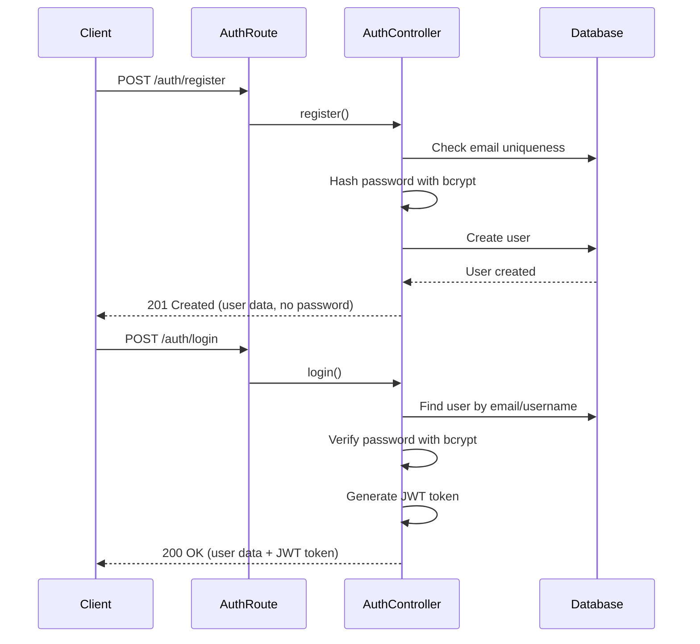
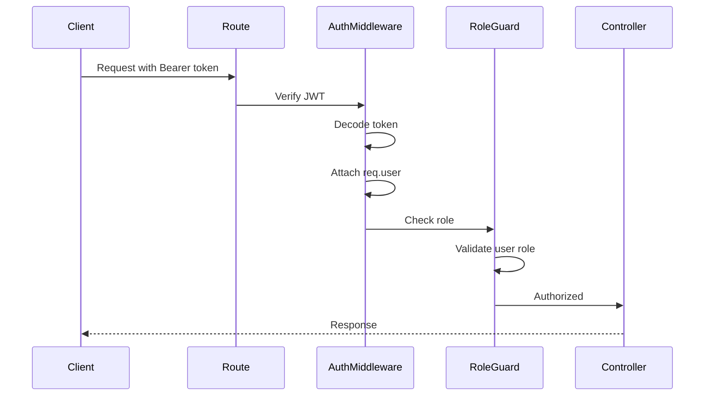

# Authentication & Authorization System - Implementation Walkthrough

## Overview

Successfully implemented a production-ready authentication and authorization system for the Train Ticket Booking System backend with the following features:

- ✅ **Secure Password Hashing**: Replaced MD5 with bcrypt (salt rounds: 10)
- ✅ **JWT Authentication**: 24-hour token expiration
- ✅ **Role-Based Access Control (RBAC)**: ADMIN and CUSTOMER roles
- ✅ **Ownership Validation**: Users can only access their own resources
- ✅ **Date Validation**: Prevents invalid ticket purchases and cancellations
- ✅ **TypeScript Type Safety**: Global Express Request type extensions

---

## System Architecture

### Authentication Flow



### Authorization Flow



---

## API Endpoints

### Public Routes (No Authentication)

#### Register New User
```http
POST /auth/register
Content-Type: application/json

{
  "username": "john_doe",
  "email": "john@example.com",
  "password": "securePassword123",
  "phone": "081234567890",
  "role": "CUSTOMER",
  "address": "123 Main St" // optional
}
```

**Response (201 Created):**
```json
{
  "status": true,
  "message": "User registered successfully",
  "data": {
    "id_user": 1,
    "username": "john_doe",
    "email": "john@example.com",
    "role": "CUSTOMER",
    "phone": "081234567890",
    "address": "123 Main St"
  }
}
```

#### Login
```http
POST /auth/login
Content-Type: application/json

// Login with email
{
  "email": "john@example.com",
  "password": "securePassword123"
}

// OR login with username
{
  "username": "john_doe",
  "password": "securePassword123"
}
```

**Response (200 OK):**
```json
{
  "status": true,
  "logged": true,
  "message": "Login successful",
  "data": {
    "id_user": 1,
    "username": "john_doe",
    "email": "john@example.com",
    "role": "CUSTOMER"
  },
  "token": "eyJhbGciOiJIUzI1NiIsInR5cCI6IkpXVCJ9..."
}
```

---

### Protected Routes

All protected routes require the `Authorization` header:
```http
Authorization: Bearer <your_jwt_token>
```

---

## Role-Based Access Control

### Route Access Matrix

| Route | Method | ADMIN | CUSTOMER | Notes |
|-------|--------|-------|----------|-------|
| **User Management** |
| `/user` | GET | ✅ | ❌ | View all users |
| `/user/:id` | GET | ✅ | ✅ | View user (ownership check) |
| `/user` | POST | ✅ | ❌ | Create user |
| `/user/:id` | PUT | ✅ | ✅ | Update user (ownership check) |
| `/user/picture/:id` | PUT | ✅ | ✅ | Update profile picture (ownership check) |
| `/user/:id` | DELETE | ✅ | ❌ | Delete user |
| **Train Management** |
| `/train` | GET | ✅ | ✅ | View all trains |
| `/train/:id` | GET | ✅ | ✅ | View train details |
| `/train` | POST | ✅ | ❌ | Create train |
| `/train/:id` | PUT | ✅ | ❌ | Update train |
| `/train/picture/:id` | PUT | ✅ | ❌ | Update train picture |
| `/train/:id` | DELETE | ✅ | ❌ | Delete train |
| **Carriage Management** |
| `/carriage/*` | ALL | ✅ | ❌ | Admin-only CRUD |
| **Seat Management** |
| `/seat/*` | ALL | ✅ | ❌ | Admin-only CRUD |
| **Schedule Management** |
| `/schedule` | GET | ✅ | ✅ | View schedules |
| `/schedule/:id` | GET | ✅ | ✅ | View schedule details |
| `/schedule` | POST | ✅ | ❌ | Create schedule |
| `/schedule/:id` | PUT | ✅ | ❌ | Update schedule |
| `/schedule/:id` | DELETE | ✅ | ❌ | Delete schedule |
| **Purchase Management** |
| `/purchase` | GET | ✅ | ❌ | View all purchases |
| `/purchase/my` | GET | ✅ | ✅ | View own purchases |
| `/purchase/:id` | GET | ✅ | ✅ | View purchase (ownership check) |
| `/purchase` | POST | ✅ | ✅ | Create purchase |

---

## Testing Examples

### 1. Register and Login Flow

**Step 1: Register a Customer**
```bash
curl -X POST http://localhost:3000/auth/register \
  -H "Content-Type: application/json" \
  -d '{
    "username": "testcustomer",
    "email": "customer@test.com",
    "password": "password123",
    "phone": "081234567890",
    "role": "CUSTOMER"
  }'
```

**Step 2: Register an Admin**
```bash
curl -X POST http://localhost:3000/auth/register \
  -H "Content-Type: application/json" \
  -d '{
    "username": "testadmin",
    "email": "admin@test.com",
    "password": "admin123",
    "phone": "081234567891",
    "role": "ADMIN"
  }'
```

**Step 3: Login as Customer**
```bash
curl -X POST http://localhost:3000/auth/login \
  -H "Content-Type: application/json" \
  -d '{
    "email": "customer@test.com",
    "password": "password123"
  }'
```

Save the returned `token` for subsequent requests.

---

### 2. Test Role-Based Access Control

**Customer Accessing Admin Route (Should Fail - 403)**
```bash
curl -X GET http://localhost:3000/user \
  -H "Authorization: Bearer <customer_token>"
```

**Expected Response:**
```json
{
  "status": false,
  "message": "Forbidden. Required role: ADMIN. Your role: CUSTOMER"
}
```

**Admin Accessing Admin Route (Should Succeed - 200)**
```bash
curl -X GET http://localhost:3000/user \
  -H "Authorization: Bearer <admin_token>"
```

---

### 3. Test Authentication

**No Token (Should Fail - 401)**
```bash
curl -X GET http://localhost:3000/schedule
```

**Expected Response:**
```json
{
  "status": false,
  "message": "Unauthorized. No token provided"
}
```

**Invalid Token (Should Fail - 401)**
```bash
curl -X GET http://localhost:3000/schedule \
  -H "Authorization: Bearer invalid_token_here"
```

**Expected Response:**
```json
{
  "status": false,
  "message": "Invalid or expired token"
}
```

---

### 4. Test Ownership Validation

**Customer Viewing Own Purchases (Should Succeed)**
```bash
curl -X GET http://localhost:3000/purchase/my \
  -H "Authorization: Bearer <customer_token>"
```

**Customer Viewing All Purchases (Should Fail - 403)**
```bash
curl -X GET http://localhost:3000/purchase \
  -H "Authorization: Bearer <customer_token>"
```

---

### 5. Test Duplicate Email Validation

**Register with Existing Email (Should Fail - 409)**
```bash
curl -X POST http://localhost:3000/auth/register \
  -H "Content-Type: application/json" \
  -d '{
    "username": "duplicate",
    "email": "customer@test.com",
    "password": "password123",
    "phone": "081234567892",
    "role": "CUSTOMER"
  }'
```

**Expected Response:**
```json
{
  "status": false,
  "message": "Email already registered"
}
```

---

## Security Features Implemented

### 1. Password Security
- ✅ **Bcrypt Hashing**: All passwords hashed with bcrypt (salt rounds: 10)
- ✅ **No Plain Text**: Passwords never stored or transmitted in plain text
- ✅ **Secure Comparison**: Bcrypt's built-in timing-safe comparison

### 2. JWT Security
- ✅ **Token Expiration**: 24-hour expiration time
- ✅ **Signed Tokens**: HMAC-SHA256 signature with secret key
- ✅ **Payload Validation**: Only essential user data in payload

### 3. Role Validation
- ✅ **Enum Enforcement**: Only 'ADMIN' and 'CUSTOMER' roles accepted
- ✅ **Registration Validation**: Role checked during user creation
- ✅ **Runtime Validation**: Role verified on every protected request

### 4. Ownership Validation
- ✅ **Purchase Access**: Users can only view/cancel their own purchases
- ✅ **Profile Access**: Users can only update their own profile (unless admin)
- ✅ **Admin Override**: Admins can access all resources

### 5. Date Validation
- ✅ **Purchase Validation**: Prevents purchases for past schedules
- ✅ **Cancellation Validation**: Prevents cancellations after departure date
- ✅ **Real-time Checks**: Uses `new Date()` for current time

---

## Files Modified/Created

### Created Files
- [authController.ts](file:///d:/sekolah/Kelas%2012/Dalam%20Sekoalh/RPL/Next/BE2/src/controllers/authController.ts) - Authentication logic
- [authRoute.ts](file:///d:/sekolah/Kelas%2012/Dalam%20Sekoalh/RPL/Next/BE2/src/routes/authRoute.ts) - Public auth endpoints
- [roleGuard.ts](file:///d:/sekolah/Kelas%2012/Dalam%20Sekoalh/RPL/Next/BE2/src/middleware/roleGuard.ts) - Role-based authorization
- [express.d.ts](file:///d:/sekolah/Kelas%2012/Dalam%20Sekoalh/RPL/Next/BE2/src/types/express.d.ts) - TypeScript type definitions

### Modified Files
- [authMiddleware.ts](file:///d:/sekolah/Kelas%2012/Dalam%20Sekoalh/RPL/Next/BE2/src/middleware/authMiddleware.ts) - Updated to attach role
- [userController.ts](file:///d:/sekolah/Kelas%2012/Dalam%20Sekoalh/RPL/Next/BE2/src/controllers/userController.ts) - Bcrypt integration
- [purchaseController.ts](file:///d:/sekolah/Kelas%2012/Dalam%20Sekoalh/RPL/Next/BE2/src/controllers/purchaseController.ts) - Fixed user interface
- [index.ts](file:///d:/sekolah/Kelas%2012/Dalam%20Sekoalh/RPL/Next/BE2/src/index.ts) - Added auth route
- [userRoute.ts](file:///d:/sekolah/Kelas%2012/Dalam%20Sekoalh/RPL/Next/BE2/src/routes/userRoute.ts) - Added role guards
- [trainRoute.ts](file:///d:/sekolah/Kelas%2012/Dalam%20Sekoalh/RPL/Next/BE2/src/routes/trainRoute.ts) - Added role guards
- [carriageRoute.ts](file:///d:/sekolah/Kelas%2012/Dalam%20Sekoalh/RPL/Next/BE2/src/routes/carriageRoute.ts) - Added role guards
- [seatRoute.ts](file:///d:/sekolah/Kelas%2012/Dalam%20Sekoalh/RPL/Next/BE2/src/routes/seatRoute.ts) - Added role guards
- [scheduleRoute.ts](file:///d:/sekolah/Kelas%2012/Dalam%20Sekoalh/RPL/Next/BE2/src/routes/scheduleRoute.ts) - Added role guards
- [purchaseRoute.ts](file:///d:/sekolah/Kelas%2012/Dalam%20Sekoalh/RPL/Next/BE2/src/routes/purchaseRoute.ts) - Added role guards

---

## Next Steps

### Recommended Enhancements

1. **Password Migration**: Existing MD5 passwords need to be migrated to bcrypt
2. **Refresh Tokens**: Implement refresh token mechanism for better UX
3. **Rate Limiting**: Add rate limiting to prevent brute force attacks
4. **Email Verification**: Add email verification for new registrations
5. **Password Reset**: Implement forgot password functionality
6. **Audit Logging**: Log authentication attempts and authorization failures

### Testing Checklist

- [x] Server starts successfully
- [ ] Register new customer account
- [ ] Register new admin account
- [ ] Login with email
- [ ] Login with username
- [ ] Access protected route with valid token
- [ ] Access protected route without token (should fail)
- [ ] Access admin route as customer (should fail)
- [ ] Access admin route as admin (should succeed)
- [ ] Customer view own purchases
- [ ] Customer view all purchases (should fail)
- [ ] Admin view all purchases (should succeed)
- [ ] Duplicate email registration (should fail)
- [ ] Invalid role registration (should fail)

---

## Summary

The authentication and authorization system is now fully implemented and ready for testing. All routes are properly protected with JWT authentication and role-based access control. The system uses industry-standard bcrypt for password hashing and follows security best practices.

**Server Status**: ✅ Running on http://localhost:3000

Use the testing examples above to verify all functionality works as expected.
